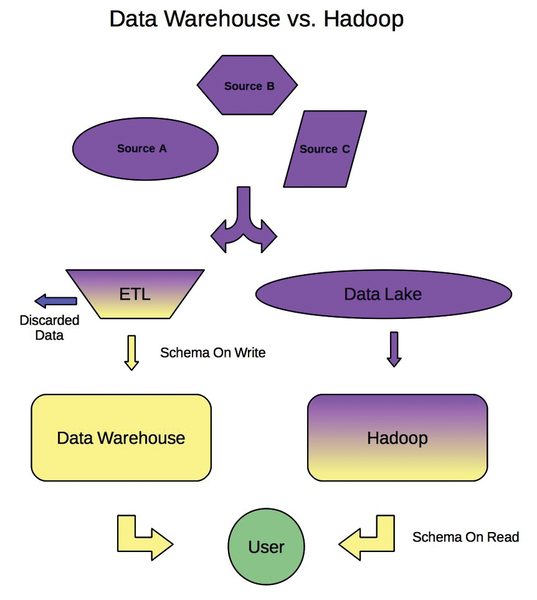

## Hadoop as a Data Lake

The traditional way of storing data is using a _data warehouse_ approach, where data undergoes a multi-step process of selecting what data is thought to be useful in the future, discarding the rest, choosing a schema to store the data into its final destination, building pipelines to clean the selected data, extract it from where it resides and transform it from its original format into the predefined schema. This process has many disadvantages, mainly it's very time consuming, non-flexible as predefined schemas can be very hard to change upon new incoming forms of data and finally, the process of selecting which data to keep and trying to comprehend its usefulness in the future may lead to the loss and waste of a huge amount of data that may actually turn to be useful.

Hadoop on the other hand implements another approach where it stores the data in its raw format in one place, namely a _Data Lake_. This approach has many benefits, mainly that it makes all data available, no need to make assumptions about future data use or pre-select which data to keep, data is shareable between different business units as it resides in one big pool and finally, a vast set of tools is availble to access and manipulate the data as needed.

Hadoop data lakes is very good complimentary approach to data warehouses.

  
    
   Image source: <a href="http://www.linux-magazine.com/Issues/2015/172/Hadoop-2-and-Apache-Spark">http://www.linux-magazine.com/Issues/2015/172/Hadoop-2-and-Apache-Spark</a>

---

## HDFS

HDFS file operations are separate from those running on the local disks, thus data must always be copied to the HDFS system before starting to work with it on Hadoop. The HDFS is optimized for reading and writing large files. When writing to HDFS, data are sliced and replicated across Hadoop cluster nodes and processed in parallel for faster computing. This happens in the background, the user can't notice this slicing and will be working with what seems to be one intact file. Replication also provides the fault-tolerance performance of HDFS.
